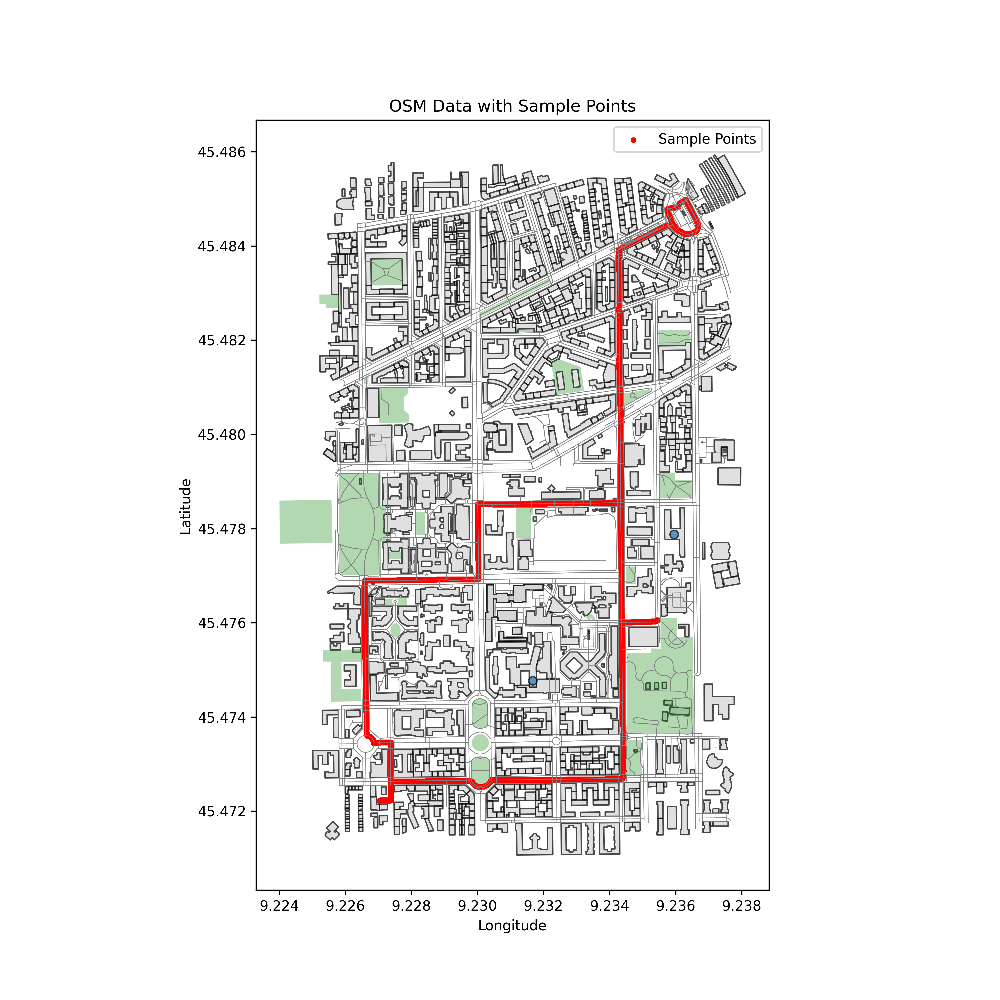

# ANTHEM: AVOIDING AND ASSESSING THE EXPOSURE TO AIR POLLUTANTS IN AN URBAN ENVIRONMENT

This repository contains the code and resources for the ANTHEM project, a research initiative focused on understanding and mitigating exposure to air pollutants in urban environments. The project combines geospatial data analysis, machine learning, and an interactive web application to provide a comprehensive tool for researchers and the public.



## Project Overview

The ANTHEM project aims to:

*   Develop a high-resolution model of CO₂ concentrations in an urban environment using a variety of data sources, including sensor data, OpenStreetMap, and weather data.
*   Create an interactive web application that allows users to visualize CO₂ concentrations, plan routes with minimal exposure, and understand the factors that contribute to air pollution.
*   Provide a platform for researchers to explore the relationship between urban form, human activity, and air quality.

## Directory Structure

The project is organized into the following main directories:

*   `app/`: Contains the source code for the Streamlit web application.
*   `data/`: Contains the raw and processed data used in the project. (Note: This directory is in `.gitignore` to protect sensitive data).
*   `notebooks/`: Contains Jupyter Notebooks for data exploration, feature engineering, and model development.
*   `src/`: Contains the source code for the data processing, modeling, and visualization pipelines.
*   `output/`: Contains the output of the data processing and modeling pipelines, including predictions and plots.
*   `models/`: Contains the trained machine learning models.

## Main Pipeline

The core of the project is a data processing and modeling pipeline that generates the CO₂ predictions used in the web application. The pipeline consists of the following main steps:

1.  **Data Ingestion and Preprocessing:** Raw data from various sources is loaded, cleaned, and preprocessed.
2.  **Feature Engineering:** A rich set of features is engineered from OpenStreetMap data, weather data, and other sources.
3.  **Model Training and Optimization:** A sophisticated ensemble model is trained and optimized to predict CO₂ concentrations.
4.  **Prediction and Visualization:** The trained model is used to generate high-resolution predictions of CO₂ concentrations, which are then visualized on a map.

## Usage

The project has two main components that can be run independently:

### 1. Web Application

The interactive web application can be run using Streamlit:

```bash
streamlit run app/app.py
```

### 2. Data Processing and Modeling Pipeline

The data processing and modeling pipeline can be run from the command line:

```bash
# To generate the street network predictions
python src/visualization/street_graph_prediction.py

# To run the ensemble model optimization
python src/ensemble/main.py
```

## Contributing

1.  Clone the repository
2.  Make sure you have all the dependencies installed (see `requirements.txt`)
3.  Create a new branch from `develop` (e.g., `feature/manova` or `feature/pca`)
4.  Make your changes
5.  If you install a new package, run `pip freeze > requirements.txt` to update the requirements file
6.  Commit and Push your changes
7.  Open a Pull Request to merge your branch into `develop`

## Data Privacy

Please do not upload any sensitive data to this repository. Every contributor is working under a Non-Disclosure Agreement (NDA) and should not share any data outside the project. For this reason, the `data/` folder is included in the `.gitignore` file.

To download the data, please refer to the shared OneDrive folder or ask the project manager for the data files.

We cannot test code using remote GitHub Actions or cloud-based services that might expose the data. All CI/CD pipelines must be run locally. If you want to approve pull requests into the `develop` branch, please use the [act](https://github.com/nektos/act) tool and ensure that the scripts work locally before merging.

## License

This project is licensed under the MIT License. See the `LICENSE` file for details.